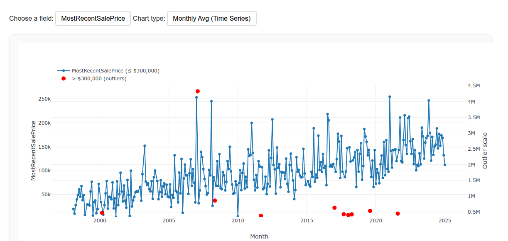
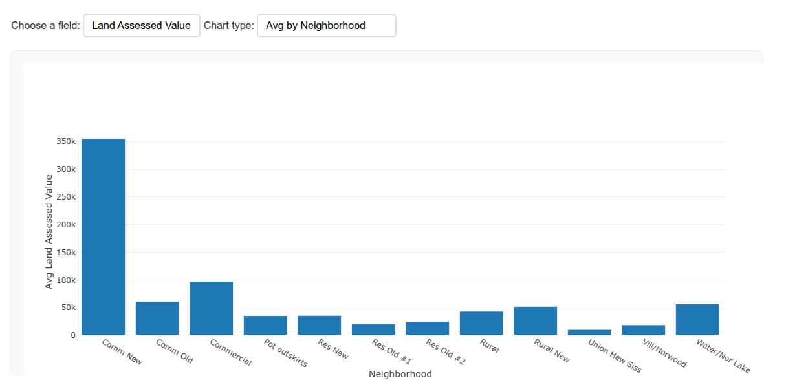
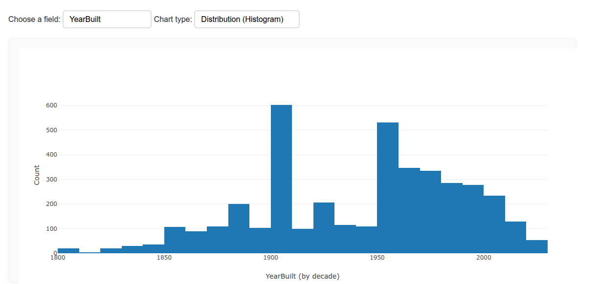

# property_visualization_plotly
visualization of Potsdam parcel evaluation data using plotly

To explore, download repo contents and run app.py

The city of Potsdam had an issue. The whole Region including City of Potsdam, Village of Potsdam, and Village of Norwood have had teir property value reassessed by GAR associates company. A lot of property values went up and people felt it didn't represent the values accurately. 

Prices mapped to their sale date

https://northcountrynow.com/stories/town-homeowners-vexed-by-assessment-increases-of-up-to-144-percent-after-gar-reval-rolls-through,288742

https://northcountrynow.com/stories/potsdam-final-assessment-roll-at-100-percent-valuation-more-than-400-grievances-filed-this-year,314749

This dashboard gathers data directly from GAR evaluation by accessing the database with the database API key found in the developer tools. This gave us the indexes for each individual property parcel, giving us the webpage to scrape. After manually assembly of data, it is now able to be reported and explored via python plotly dash application giving insights into current data and historical trends.

Assessment of land parcels without the properties

Timeline of development of the city

